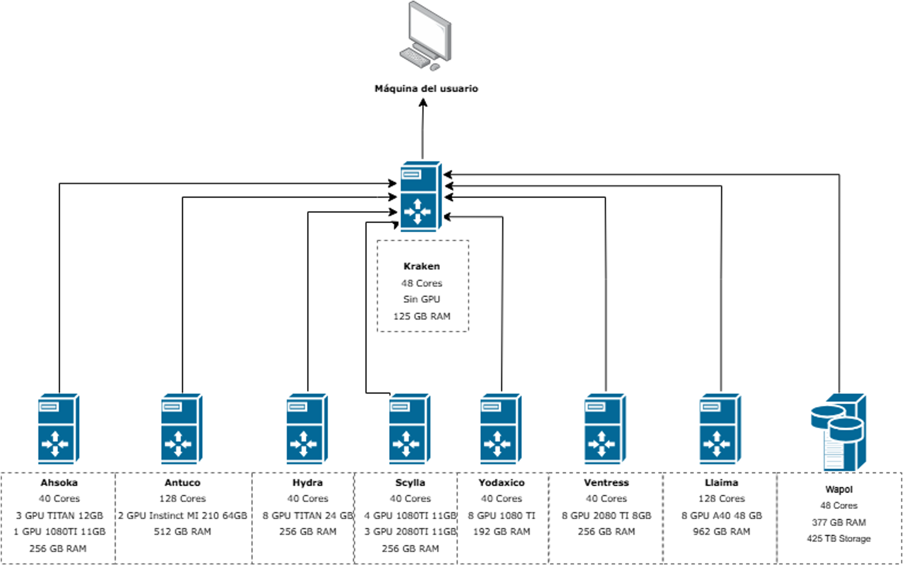

# Hardware del Clúster

## Arquitectura

El clúster está compuesto por dos tipos de nodos:

- **Nodo de entrada (Kraken):** punto de acceso al clúster, preparación y envío de tareas. **No ejecuta cargas intensivas.**
- **Nodos de cómputo (Hydra, Scylla, Llaima, etc.):** ejecutan los trabajos y contienen CPU, RAM y GPU compartidos entre usuarios.

## Nodos de computo disponibles

| Nodo | Cores | RAM | RAM |
|------|-------|-----|-----|
| Ahsoka | 48 | 256 GB | 3× TITAN 12 GB + 1× 1080Ti 11 GB |
| Hydra | 40 | 256 GB | 8× TITAN 24 GB |
| Scylla | 40 | 256 GB | 4× 1080Ti 11 GB + 3× 2080Ti 11 GB |
| Yodaxico | 40 | 192 GB | 8× 1080Ti 11 GB |
| Ventress | 40 | 256 GB | 8× 2080Ti 8 GB |
| Llaima | 128 | 962 GB | 8× A40 48 GB |
| Antuco | 128 | 512 GB | 2× Instinct MI210 64 GB (AMD) |
